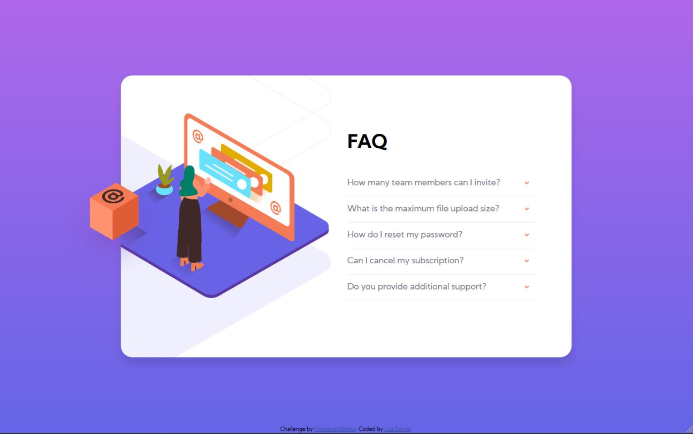

# Frontend Mentor - FAQ accordion card solution

This is a solution to the [FAQ accordion card challenge on Frontend Mentor](https://www.frontendmentor.io/challenges/faq-accordion-card-XlyjD0Oam). Frontend Mentor challenges help you improve your coding skills by building realistic projects.

## Table of contents

- [Overview](#overview)
  - [The challenge](#the-challenge)
  - [Screenshot](#screenshot)
  - [Links](#links)
- [My process](#my-process)
  - [Built with](#built-with)
  - [What I learned](#what-i-learned)
  - [Continued development](#continued-development)

## Overview

### The challenge

Users should be able to:

- View the optimal layout for the component depending on their device's screen size
- See hover states for all interactive elements on the page
- Hide/Show the answer to a question when the question is clicked

### Screenshot

### Links

- Solution URL: [https://github.com/FrontendMentor-Lecap/Faq-Accordion-Card/settings]
- Live Site URL: [https://frontendmentor-lecap.github.io/Faq-Accordion-Card/]

## My process

### Built with

- Semantic HTML5 markup
- CSS custom properties
- Flexbox

### What I learned

Placing each of the images was a difficult task, it was a challenge to place the box outside the main element while setting main with an overflow of hidden.
I wanted to place each of the FAQ questions and answers without using JS, so that was also a challenge, specially playing with the :checked value, and modifying other elements. In this case I had to modify:

1. The arrow, so that it rotates 180 degrees.
2. The title, so it turns into a black color and bold.
3. Answer appears, as the display value changes from none to block.

As I exposed before, I really liked this challenge but I used a lot of time performing it. It still has a lot of room for improvement but I'm ready to present it to community.

### Continued development

I would like to continue focusing on transitions and animations. Also I would like to continue using CSS instead of JavaScript when it is possible.
